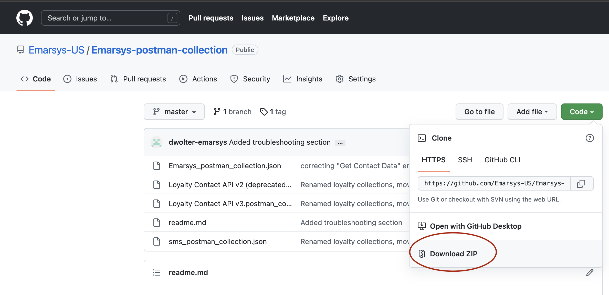
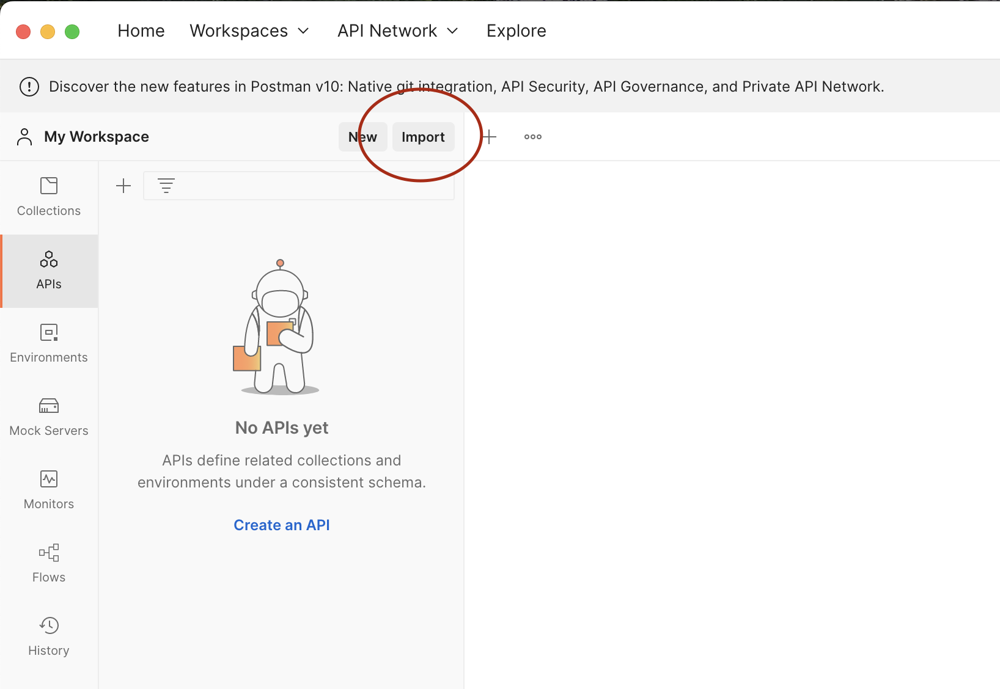
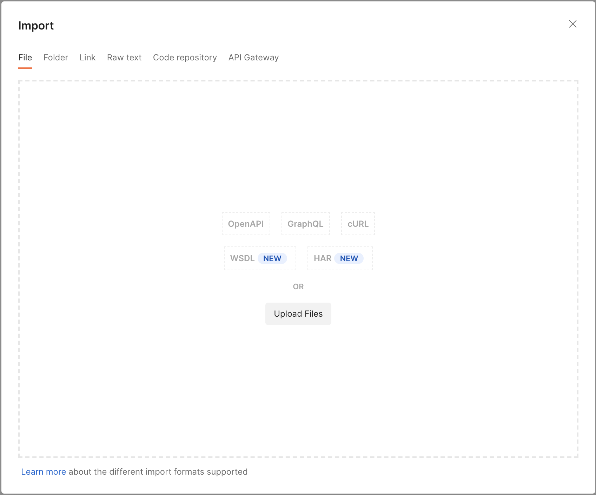

# Emarsys API Developer tooling
**Available in Postman and Bruno formats**

This document describes the Emarsys Suite API v3, which uses OpenID Connect (OAuth 2.0 client credentials grant) authentication. 

- Other API collections, including the Emarsys suite WSSE APIs: [link](./wsse_APIs/)
- Introduction to Emarsys API: [link](https://help.sap.com/docs/SAP_EMARSYS/5d44574160f44536b0130abf58cb87cc/fdf6023c74c11014b724bbfdb6028c98.html?locale=en-US)
- Setting up API credentials: [link](https://help.sap.com/docs/SAP_EMARSYS/5d44574160f44536b0130abf58cb87cc/fdf4b58974c110149353957a3e7ef453.html?locale=en-US)

---

### Quick links
| | |
|---|---|
| 🔑 | [Creating your API user](#creating-your-api-user) |
| 🟠 | [Using with Bruno](#using-with-bruno) |
| 📮 | [Using with Postman](#using-with-postman) |
| 🌐 | [Selecting an API endpoint](#selecting-an-api-endpoint-data-center) |

---

## Creating your API user

To create your API user, follow [this documentation guide for OpenID Connect](https://help.sap.com/docs/SAP_EMARSYS/5d44574160f44536b0130abf58cb87cc/fdf4b58974c110149353957a3e7ef453.html#openid-connect)

> [!NOTE]
> Be sure to copy your all of the credential details from the gray text boxes to a secure location immediately, as you won't be able to access them again!


## Using with Bruno

[Bruno](https://docs.usebruno.com/) is an open-source API tool that is fully free to use and is supported by the Open-Source community. This collection ships with a native Bruno format that includes pre-configured OAuth2 settings.

### Setting up the Bruno collection

The Bruno collection is generated locally from the Postman source.

Prerequisites:
- [Bruno](https://www.usebruno.com/downloads) — the API client
- [mise](https://mise.jdx.dev/) — task runner (`brew install mise` on macOS, or see [install docs](https://mise.jdx.dev/getting-started.html))
- [Node.js](https://nodejs.org/) — if not already installed, mise will install it automatically

Steps:
1. Clone or download this repository
1. Run the setup task:
    ```bash
    mise run setup-bruno
    ```
    This generates the `bruno/` folder with all requests, environments, and pre-configured OAuth2 settings. It also creates `.env.<environment>` files where you can store your credentials.

1. Fill in your `OIDC_ClientId` and `OIDC_Secret` in the appropriate `.env.*` file(s) under `bruno/`:
    - `.env.Emarsys EU Production`
    - `.env.Emarsys EU Staging`
    - `.env.Emarsys US1 Production`
    - `.env.Emarsys US1 Staging`

1. Open Bruno and click **"Open Collection"**, then select the `bruno/` directory

1. Select the environment matching your emarsys suite instance from the environment dropdown in Bruno's sidebar 

> [!NOTE]
> If you are using [SAP Cloud Identities](https://help.emarsys.com/hc/en-us/articles/22036625729554-Security-settings-API-Credentials#openid-connect-sap-cloud-identity) to manage your Emarsys API credentials, you will need to update the `OIDC_TokenUrl` variable in the Bruno environment settings.

> [!TIP]
> You can re-run `mise run setup-bruno` at any time to update the collection from the Postman source. Your `.env.*` files with credentials will be preserved.


## Using with Postman

### Installing the collection in Postman
1. First, make sure you have Postman installed. These collections are meant to be used with the program Postman, which can be downloaded here: https://www.postman.com/downloads/
2. Download this repository by clicking on the Green "Code" button at the top of this page, then "Download Zip":
  
3. Extract the files from the .zip folder
4. With Postman installed and the collections downloaded, click on the import button in the top-left:
  
5. Select The upload files option:
    
6. Select the file `postman/Emarsys_postman_collection.json` from the downloaded files
7. Finally, select the import button to confirm and the package will be fully installed!
 
### Setting up your API user in Postman

1. In Postman, click on the folder for the Emarsys API collection, then select the Authorization tab
1. Scroll down to the "Configure New Token" section where you will see red text in the boxes for Client ID and Client Secret

1. Hover your mouse over the red text for {{OIDC_ClientID}} to see the options of where to store this variable. Click the Environment section to save the variable. If you see text that says "No environment selected", click "Create One" and give it a name like "Emarsys environment"

    
1. In the "Enter Value" checkbox, enter the value you saved from the Emarsys API user creation screen. Do this for Client ID and Client Secret. The text for each will turn from red to blue once it's configured correctly
    1. ***NOTE*** If you are using [SAP Cloud Identities](https://help.emarsys.com/hc/en-us/articles/22036625729554-Security-settings-API-Credentials#openid-connect-sap-cloud-identity) to manage your Emarsys API credentials, you will need to replace the Access Token URL as well
1. Scroll to the bottom of the window and click the Orange "Get New Access Token" button. Postman will take a moment to make sure your credentials work, then report it was successful. Click "Proceed" on this window, then click "Use Token"
1. Your credentials are now configured!


## Selecting an API endpoint (data center)

Every request URL in this collection points at the variable `{{apiHost}}` instead of a hardcoded hostname. To switch between data centers, import one of the ready-made environment files from the `postman/environments/` folder:

| File                                    | Data center   | Host                                 |
| --------------------------------------- | ------------- | ------------------------------------ |
| `EU-Production.environment.json`        | EU Production | `api.emarsys.net`                    |
| `EU-Staging.environment.json`           | EU Staging    | `api-proxy.s.emarsys.com`            |
| `US1-Production.environment.json`       | US Production | `us1-01.api.cloud.sap.emarsys.net`   |
| `US1-Staging.environment.json`          | US Staging    | `us1-01.api.s.sap.emarsys.com`       |

**Postman:** click the gear icon (Manage Environments) → Import → pick the file. Then choose the environment from the dropdown in the top-right of the Postman window.

**Bruno:** the `bruno/environments/` folder already contains these environments in Bruno format. Select the appropriate one from the environment dropdown in Bruno's sidebar.

If no environment is selected, the collection falls back to its built-in default of `api.emarsys.net` (EU Production).


